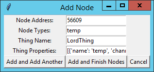
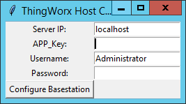

# Lord Microstrain - ThingWorx Interface API Application
## Connecting IoT Sensors to a Data Analysis Platform Using Python

### Requirements
* Python 3.6 64-Bit [Python Download](https://www.python.org/ftp/python/3.6.0/python-3.6.0-amd64.exe)
* LORD SensorConnect [Lord Website](http://www.microstrain.com/software)
  * This software is required to install due to the need for windows to have device drivers.  Installing the software will install the required drivers and allow your machine to configure a COM port for the base station.
* Microsoft Visual C++ 2017 [Download Link](https://aka.ms/vs/15/release/vc_redist.x64.exe)

### Setup & Configuration
* Provided in the repository is a file, config.json.sample
* Copy this file to config.json
  * `cp config.json.sample config.json`

#### Editing the Config File
The config file can be edited to allow for easy running of the application.  If the file is not updated before running, the application will prompt for the required information and save everything but the authentication password into the config.json file.  To add these manually, take note of these points:
* The config contains several data fields that need to be filled in for ThingWorx:
  * "thingworx\_host": "<ip>"   (The IP address of the ThingWorx Server)
  * "app\_key": "<string>"      (The App Key obtained from ThingWorx Server)
  * "http\_username": "<string>"(The Username used to log into ThingWorx)
* Configuration for the Base Station should be changed. These values are:
  * "com\_port": "<COM#>"       (The COM port where the device is connected)
  * "baud\_rate": <number>      (The baud rate the base station communicates at)
* In addition, users can add node information to the "nodes" array. **Take caution to adhere to JSON formatting rules**
  * This segment is a JSON Array and has the following format: [{},{},{}..]
  * Each type of node will have a slightly different configuration, but each node shares these data fields:
    * "node\_addr": <number>,           (Address of the node, usually on the node itself)
    * "node\_type": "<string>",         (Type of the node, this is important in the code of this application)
    * "thing\_name": "<string>",        (Name of the Thing in ThingWorx)
    * "thing\_properties": <JSON Array> (Array of properties for the node)
  * The properties of a node are as follows:
    * "name": "<string>",       (Name of the property in ThingWorx)
    * "channel": "<string>",    (Some nodes have a channel for the data, if no channel put "none")
    * "type": "<string>"        (The type ThingWorx considers the data to be)
* The following are examples for a Temperature Sensor and a Force Transducer:
  * ```
    {
            "address": 56609,
            "type": "temp",
            "thing_name": "lordThing",
            "thing_properties": [
                {
                    "name": "temp",
                    "channel": "ch1",
                    "type": "NUMBER"
                }, {
                    "name": "internal_temp",
                    "channel": "ch7",
                    "type": "NUMBER"
                }]
    }
    ```
  * ```
    {
            "address": 57861,
            "type": "force",
            "thing_name": "forceThing",
            "thing_properties": [
                {
                    "name": "force",
                    "channel": "none",
                    "type": "NUMBER"
                }]
            }]
    }
    ```
### Running the Application
After installing the required software listed above, running the application is simple:
* Plug in your base station and turn on your nodes
* Verify the COM Port your base station is using (Windows Device Manager)
* Double-Click the file, `main.py` and a command prompt window will appear (you may need to double-click a second time)
* The configuration prompts will appear and you can click through them



  * The node properties prompt is very specific in what is required for the entry.  The data must be in a JSON Array format.  For example, if typing or pasting in data for a Temperature Node with 2 sensor channels, in the properties entry put: `[{"name":"temp","channel":"ch1","type": "NUMBER"},{"name":"internal_temp","channel":"ch7","type":"NUMBER"}]`



### The ThingWorx Side
Future development will reinforce the current functionality that this application has in regards to interacting with ThingWorx.  The current status allows data to be sent, but creating Things and Mashups is not possible.
* NOTE: ThingWorx 8 seems to have a current bug that causes properties of a thing to not update if it was created by the API.  In other words, if this python program creates a Thing for the node, the data sent to the Thing will be ignored.
This means that it is necessary for to manually create Things and Mashups.  The essential part of this is as follows:
* Create a Thing with a RemoteThing Template
* Add properties to the Thing with a name and a type (these will correspond to the properties in the config file)
* (Optional) Create a mashup to view the data in a graph or other visual
* Add permissions for the user to read and write data at runtime

### Viewing the Data
Without a mashup, data can be viewed directly on the Thing page.  With a mashup, the ThingWorx interface can display the data from the properties.  To read more about mashups, see the ThingWorx website.

The `templates` directory contains XML files that are templates for a Force Sensor Thing and Force Sensor Mashup to use as examples.

#### Licensing Notes
The MSCL Libraries provided in packages/mscl.py and packages/\_mscl.pyd are released under and MIT License. You can see this license in the file, `LICENSE`
